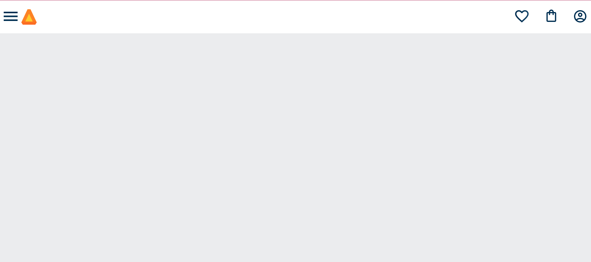
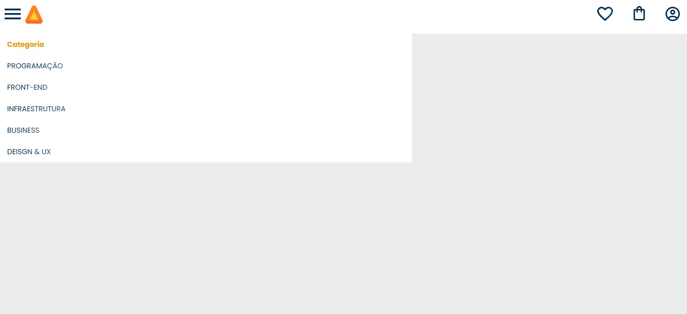

<h1>ALURABOOKS</h1> 

   

> Status do Projeto: :warning: em desenvolvimento

## Descrição do projeto 

  Descrição breve do projeto compondo um paragrafo ou dois. 

## Layout ou Deploy da Aplicação :dash:

## Autora

- Frontend Mentor - [@natsmarinho](https://www.frontendmentor.io/profile/natsmarinho)
- Twitter - [@natsmarinho](https://www.twitter.com/natsmarinho)
- Instagram - [@natsmarinho](https://www.instagram.com/natsmarinho/)